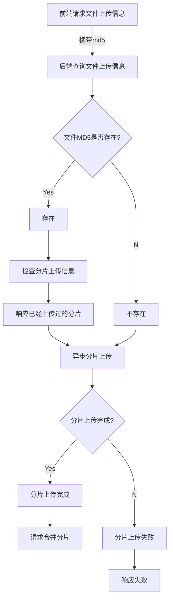

# HotKey IM

[toc]

### 文件消息设计

#### 文件分片上传

```mermaid
graph TD
front[前端请求文件上传信息]-.携带md5.->backend[后端查询文件上传信息]
--> md5{文件MD5是否存在?}
md5 -- Yes --> md5_exists[存在]
md5_exists-->check_info[检查分片上传信息]-->uploaded_slices[响应已经上传过的分片]
-->split_upload
md5 --No--> md5_no_exists[不存在]
--> split_upload[异步分片上传]
--> split_upload_over{分片上传完成?}
--Yes--> upload_over[分片上传完成]-->merge[请求合并分片]
split_upload_over--No--> upload_fail[分片上传失败]-->fail[响应失败]


```

