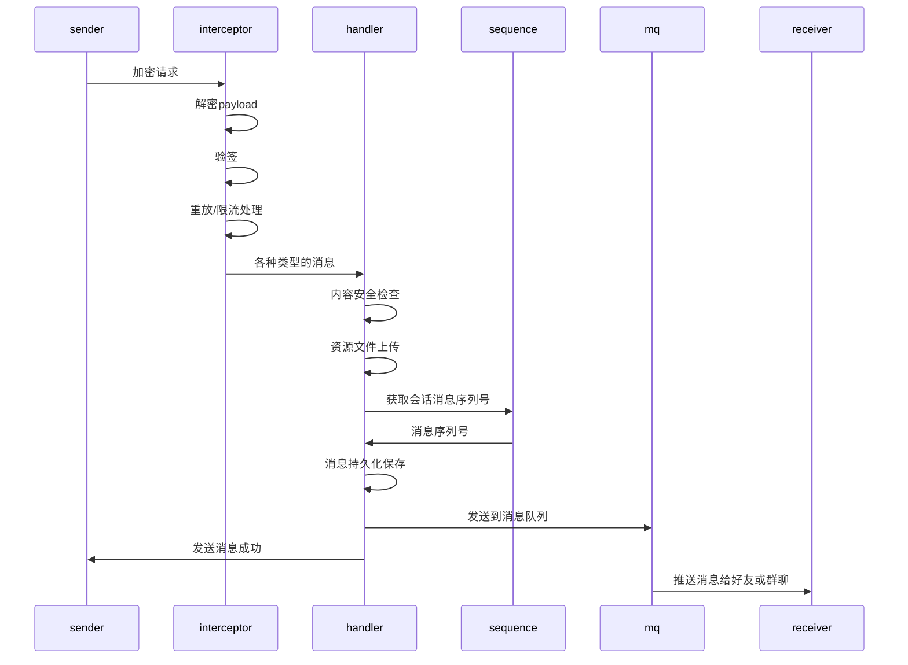
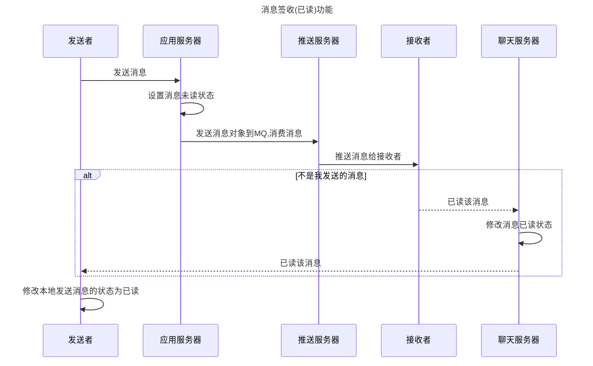
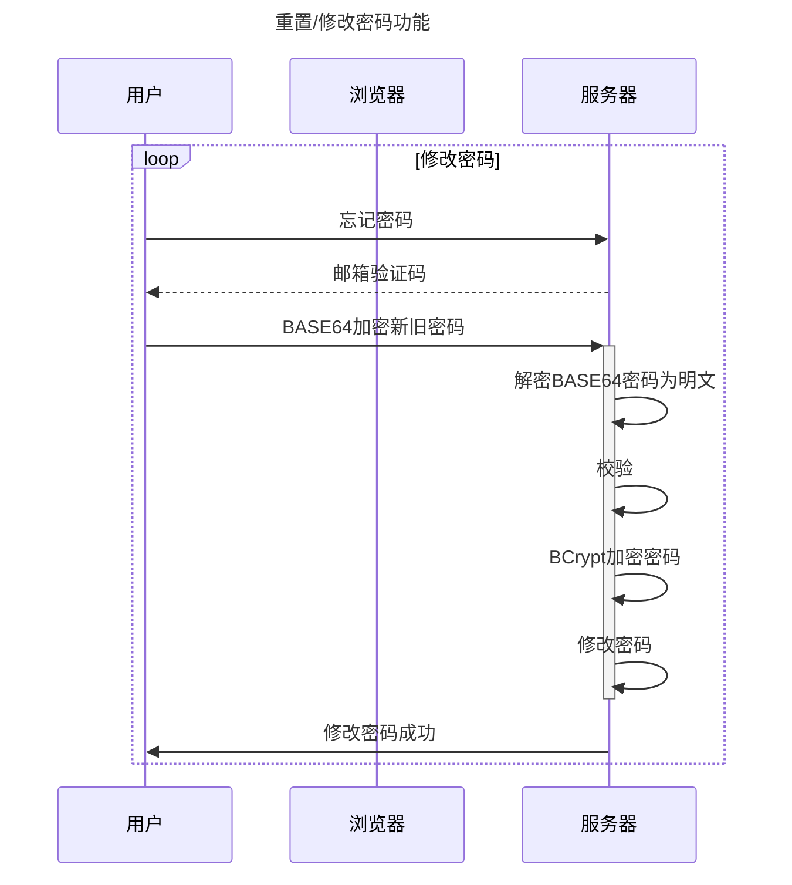
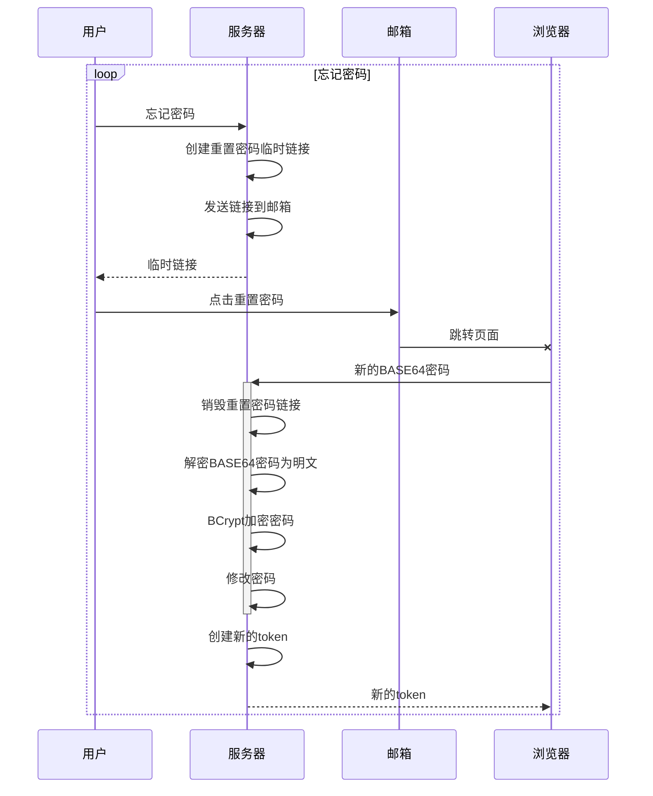
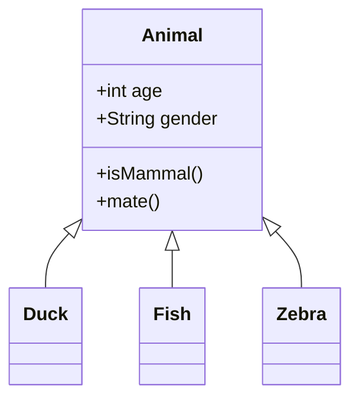
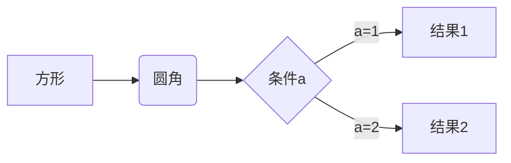

https://dev.to/ivangavlik/decoupling-using-example-in-java-4cgb

### 发送消息到接收消息时序图

```mermaid
sequenceDiagram
sender->>interceptor: 加密请求
interceptor->>interceptor: 解密payload
interceptor->>interceptor: 验签
interceptor->>interceptor: 重放/限流处理
interceptor->>handler: 各种类型的消息
handler->>handler: 内容安全检查
handler->>handler: 资源文件上传
handler->>sequence: 获取会话消息序列号
sequence->>handler: 消息序列号
handler->>handler: 消息持久化保存
handler->>mq: 发送到消息队列
handler->>sender: 发送消息成功
mq->>receiver: 推送消息给好友或群聊
```

### 消息签收(已读功能)

```mermaid
sequenceDiagram
title: 消息签收(已读)功能
发送者->>应用服务器: 发送消息
应用服务器->>应用服务器: 设置消息未读状态
应用服务器->>推送服务器: 发送消息对象到MQ,消费消息
推送服务器->>接收者: 推送消息给接收者
alt 不是我发送的消息
接收者-->>聊天服务器: 已读该消息
聊天服务器->>聊天服务器: 修改消息已读状态
聊天服务器-->>发送者: 已读该消息
end
发送者->>发送者: 修改本地发送消息的状态为已读
```

### 重置/修改密码功能

```mermaid
sequenceDiagram
title: 重置/修改密码功能
participant 用户
participant 浏览器
loop 修改密码
用户->>服务器: 忘记密码
服务器-->>用户: 邮箱验证码
用户->>+服务器: BASE64加密新旧密码
服务器->>服务器: 解密BASE64密码为明文
服务器->>服务器: 校验
服务器->>服务器: BCrypt加密密码
服务器->>-服务器: 修改密码
服务器->>用户: 修改密码成功
end

```

```mermaid
sequenceDiagram
loop 忘记密码
用户->>服务器: 忘记密码
服务器->>服务器: 创建重置密码临时链接
服务器->>服务器: 发送链接到邮箱
服务器-->>用户: 临时链接
用户->>邮箱: 点击重置密码
邮箱-X浏览器: 跳转页面
浏览器->>+服务器: 新的BASE64密码
服务器->>服务器: 销毁重置密码链接
服务器->>服务器: 解密BASE64密码为明文
服务器->>服务器: BCrypt加密密码
服务器->>-服务器: 修改密码
服务器->>服务器: 创建新的token
服务器-->>浏览器: 新的token
end
```

```mermaid
classDiagram
      Animal <|-- Duck
      Animal <|-- Fish
      Animal <|-- Zebra
      Animal : +int age
      Animal : +String gender
      Animal: +isMammal()
      Animal: +mate()
```

### 撤回消息

```mermaid
graph LR;
		A[方形]-->B(圆角)
		B-->C{条件a}
		C-->|a=1|D[结果1]
		C-->|a=2|E[结果2]
```

